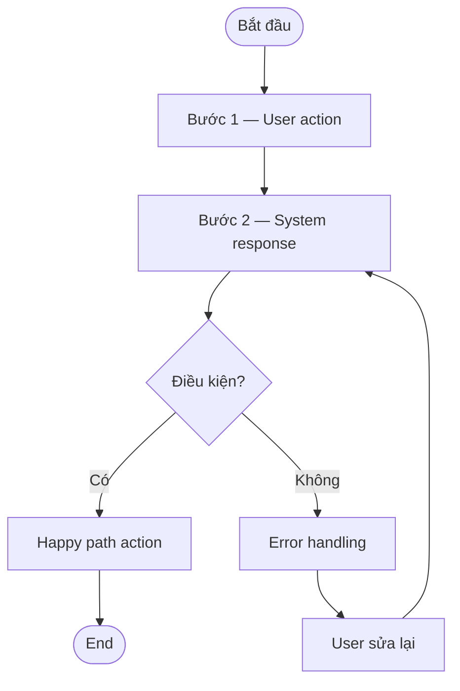

# Spec [N]. [Feature Name]

## Lịch sử thay đổi

| Version | Create by | Content before adjustment | Content after adjustment |
| --- | --- | --- | --- |
| V1.0 | [BA Name] | Tạo mới tài liệu | |

## Mô tả tài liệu

**A. Link Jira:** TBD

**B. User Story:** Là một [role], tôi muốn [action] để [goal]

**C. Workflow:**



**D. Design:** TBD — link to Figma / design-instruction file

**E. Business Rules:**

| # | ID | Description |
|---|----------|-----------------|
| 1 | BR-01 | [Description] |


**F. Functional requirement:**
| # | ID | Description |
|---|----------|-----------------|
| 1 | FR-01 | [Description] |
| 2 | FR-02 | [Description] |

**G. Non-Functional requirement:**
| # | Scenario | Input/Điều kiện |
|---|----------|-----------------|
| 1 | NFR-01 | [Description] |
| 2 | NFR-02 | [Description] |

**H. Edge Cases:**

| # | Scenario | Input/Điều kiện | Expected behavior |
|---|----------|-----------------|-------------------|
| 1 | EC-01 | [Description] | [Description] |
| 2 | EC-02 | [Description] | [Description] |

**I. Bảng mô tả trường:**

***[Section name]***

|STT| Trường thông tin | Loại control | Mô tả ý nghĩa |Required|Max length| Ràng buộc |Thông báo lỗi| Ví dụ |Design instruction|Nguồn dữ liệu|
| --- | --- | --- | --- | --- |---|---|---|---|---|---|
|1| [Field] | [Loại] | [Description] | Yes/No| [Số] | [Constraints] | [Error message] |[Ví dụ]|[Mô tả thông tin về UI/Behavior/Design ]|[Nguồn dữ liệu]|

---

**J. Use cases / User stories liên quan**
- Xóa mục này nếu không có

| Ticket | Tên tính năng / User Story | Quan hệ | Ghi chú |
|--------|---------------------------|---------|---------|
| [ID] | [Tên] | Ảnh hưởng đến / Bị ảnh hưởng bởi / Liên kết | [Mô tả ngắn về điểm ảnh hưởng] |

---

**K. Open Questions**
- Xóa mục này nếu không có

| # | Câu hỏi | Owner | Blocking? | Deadline |
|---|---------|-------|-----------|---------|
| 1 | | | | |

---

## HITL Checklist

- [ ] User Story đúng intent không?
- [ ] Workflow (C) đúng flow không? Có error path covering không?
- [ ] Business Rules (E) đủ không?
- [ ] Functional Requirements (F) đã cover đủ capability?
- [ ] Non-Functional Requirements (G) có con số phù hợp không?
- [ ] Edge Cases (H) đã cover đủ?
- [ ] Field table (I) đủ tất cả trường + validation rules?
- [ ] Use cases liên quan (J) có đúng + đủ không?

---

## L. Figma Design Code

```json
{
  "id": "[Node ID]",
  "name": "[Component Name]",
  "type": "[FRAME/COMPONENT]",
  "styles": {
    "fills": ["[colors]"],
    "fontFamily": "[font]",
    "fontSize": [size]
  },
  "children": [
    {
      "id": "[Child Node ID]",
      "name": "[Child Name]",
      "type": "[TEXT/FRAME]",
      "characters": "[content]"
    }
  ]
}
```

*Ghi chú: Section này chứa JSON code từ Figma MCP, dùng cho reference hoặc handoff sang design/engineering. Xóa nếu không cần.*

---

## v2 — Section bắt buộc (khi feature có UI)

### Message Placement
| Message (MSG-*) | Surface (inline/toast/banner/modal) | Dismiss |
|---|---|---|
| MSG-ERR-01 | inline | — |

### Control States
| Control | disabled (điều kiện) | active | loading |
|---|---|---|---|
| Button Lưu | required chưa đủ | đủ + không lỗi | khi đang lưu |

### Overlay Context (modal/drawer)
| Close Trigger | Outcome | Có lưu? |
|---|---|---|
| X / backdrop / Esc / Hủy | đóng, quay về màn cha | Không |
| Xác nhận | kiểm tra → lưu → đóng | Có |

> Field table (Section I) dùng deviation model `(default)` theo control-type-library.md.

---

## v2 — Screen Spec "7-block" + Trace/Freshness frontmatter

### Frontmatter tối thiểu (thay block metadata cũ) — mở khóa trace-graph + freshness loop
```
---
artifact: Spec
ticket-id: [VPR-xxx]
feature: [slug]
status: Draft            # Draft | HITL Review | Approved
stale_status: current    # current | stale | unknown
linked_ids: [F-01, SCR-01, BR-DISPLAY-01]     # trace ngược PRD/registry
depends_on: []           # upstream (spec/PRD section, registry code)
produces_for: []         # downstream (05-design, 06-stories)
changelog:
  - [YYYY-MM-DD] | write-spec | initial
---
```

### Block Overview (đầu Section B — Mô tả) — Portal/Nav/Active-menu
```
### Overview
- Portal: [PORTAL-ADMIN — VisibilityPRO Portal]
- Nav Schema: [NAV-xxx] · Active menu: [tên menu item — phải nằm trong Menu Item List PRD Section 4]
- Screen(s): [SCR-01 ...] · Shell: sidebar + topbar (+ tab bar nếu PRD define)
```

### Section J (nâng cấp) — Phụ thuộc chéo (Cross-Function Impact)
Thay "Use cases liên quan" dạng list bằng bảng có ID + chiều tác động (impact-ready):
| ID | Depends on / Produces for | Data/State | Ticket | Ghi chú |
|---|---|---|---|---|
| SCR-02 | Depends on | trạng thái áp dụng | VPR-001 | — |
| 06-stories/X | Produces for | field mới | VPR-001 | — |
